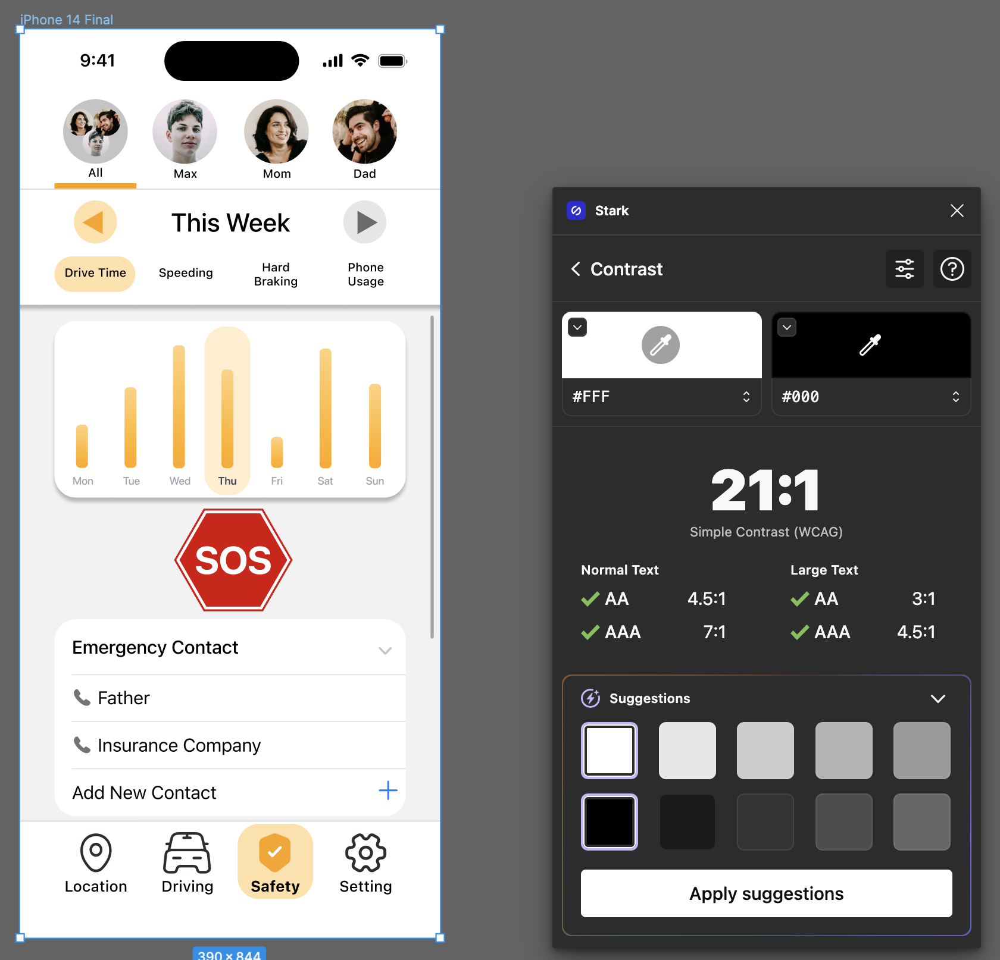
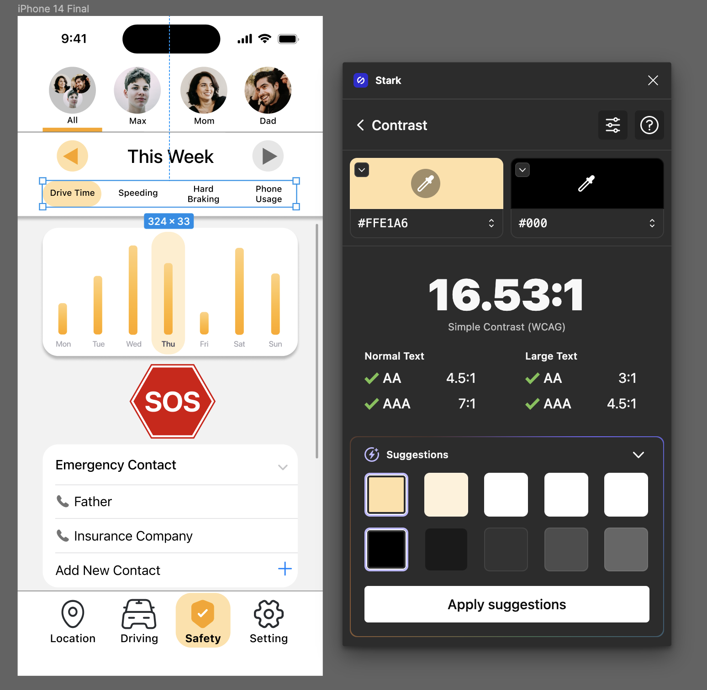
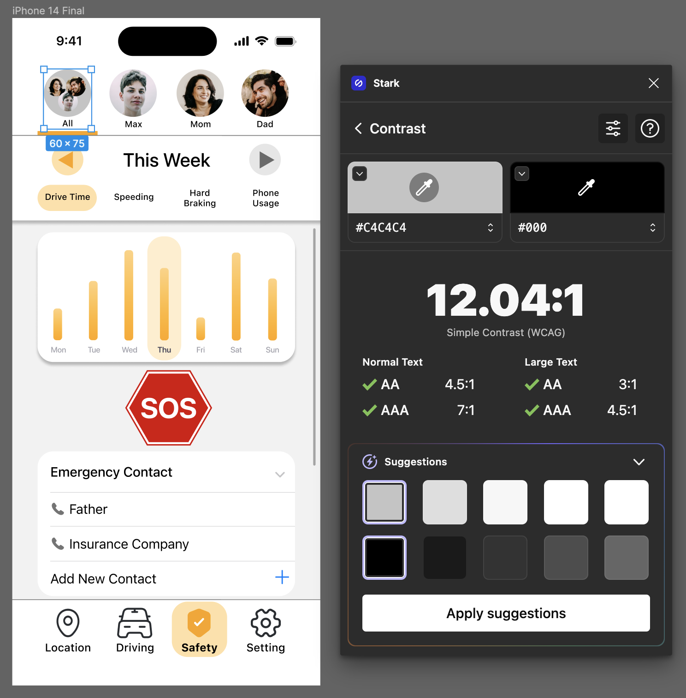
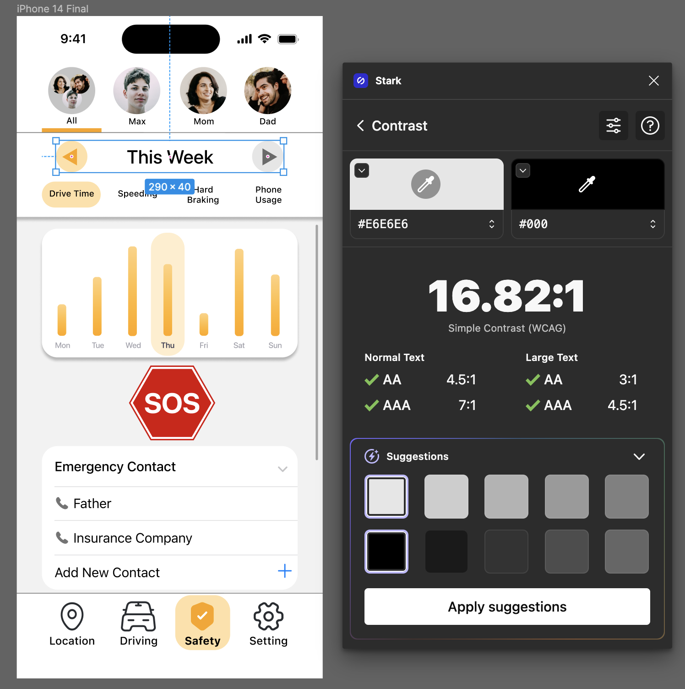
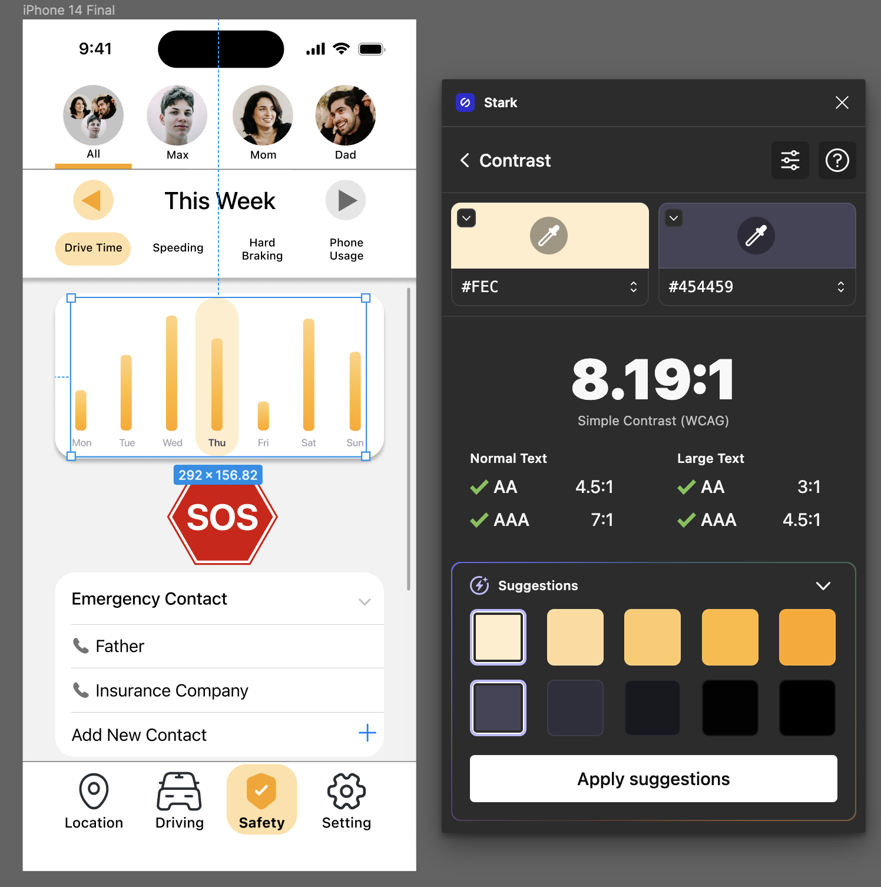
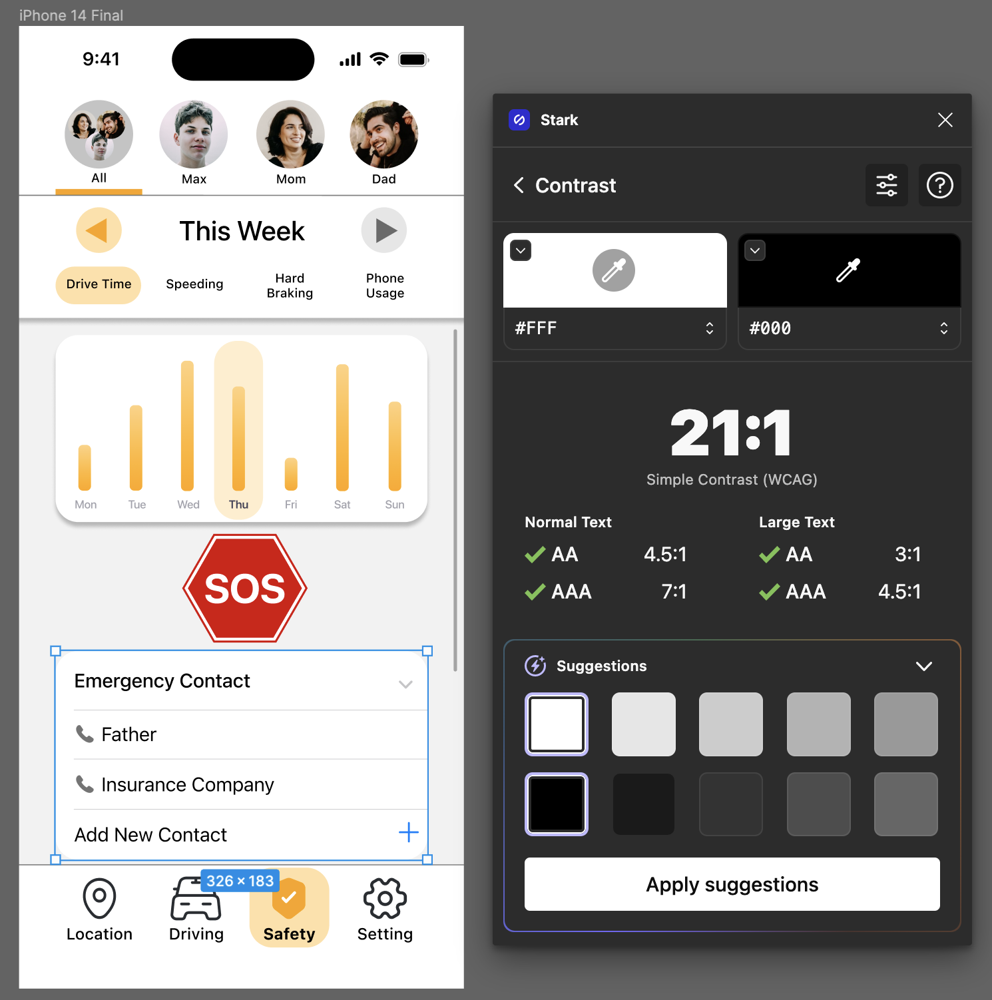
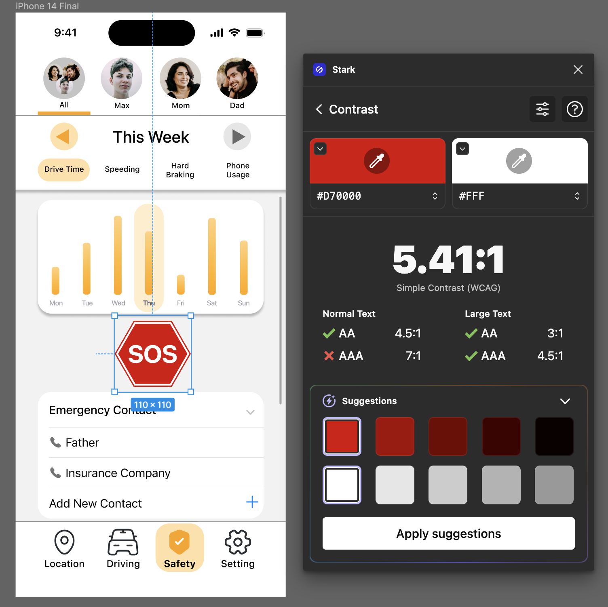
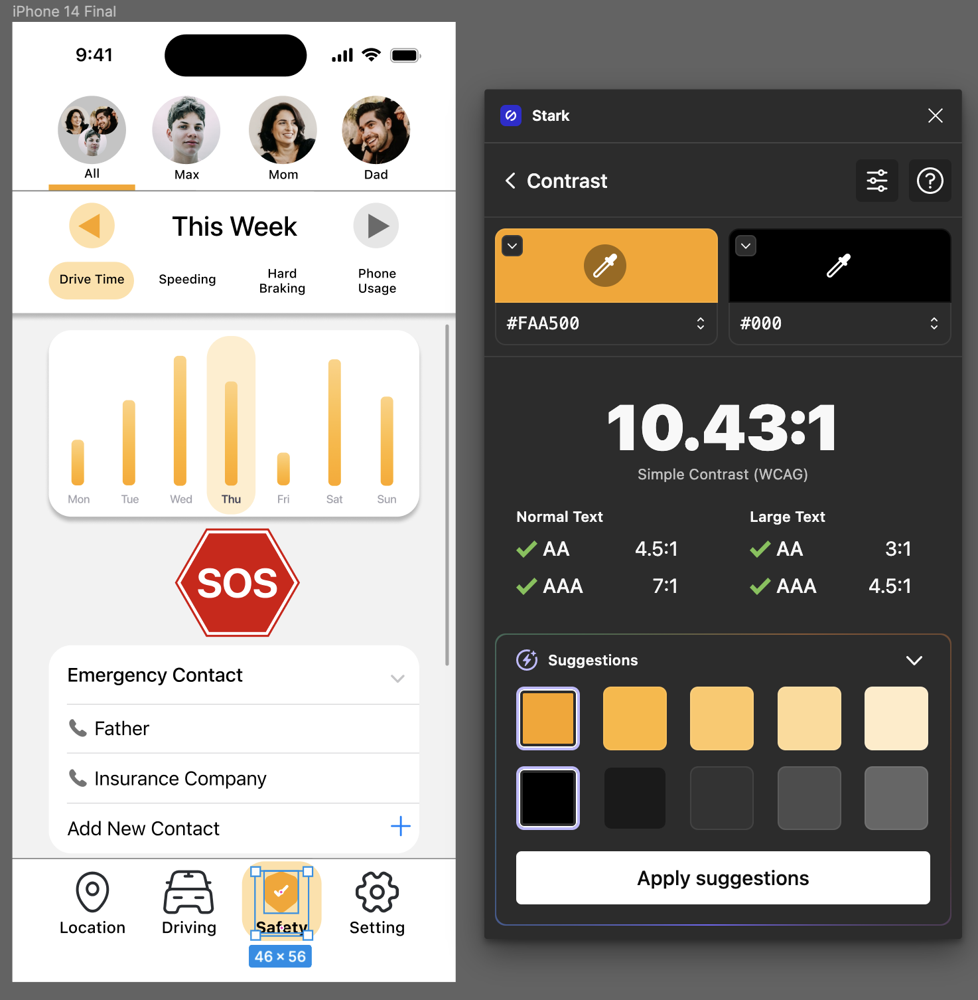
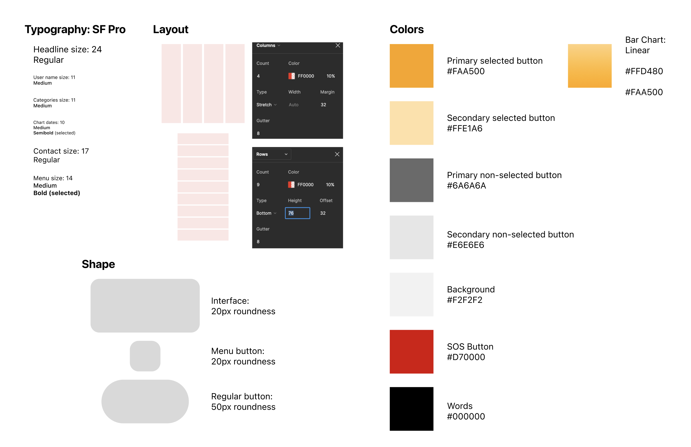

# DH110 Assignment 06: interface design system
### Yongsen Huang/Spring 2023

## Description of the project
The primary objective of this assignment is to establish a consistent and cohesive design language for the TribeTrack interface, thus enhancing the wireframe and improving the overall user experience. This will involve the creation of design elements such as font, shape, color, and layout, which will be integrated into the interface to provide a coherent and visually appealing design.

The TribeTrack app is designed to help users track the location of family members, create customized geofences, and provide emergency calling functionality. Therefore, the interface will be focused on providing a seamless user experience through simple yet effective interactions and providing the necessary features to achieve the app's objectives. As a result, the app will involve more words and settings interactions than graphic interactions, which will require careful consideration in terms of the design and layout to ensure a clear and concise user interface.

## URLs
[Impression Testing](https://ucla.zoom.us/rec/share/XAC87ajr2To0k33DwEg2JMwagfGeOcI7nAgOmNusEdP8-0R2cEQLVQyO0hBQiwfM.KS1QvEqbWpxEJs4f?startTime=1684198488000)

[Wireflow](https://www.figma.com/file/IoNDbWLC76rUESJ75NUv6S/DH110---a05-low-fidelity?type=design&node-id=0%3A1&t=AzWB3HxaZlueMiUC-1)

[Interface Designs](https://www.figma.com/file/U07YL4kGPMfyTEevHMFJdS/Interface-Design?type=design&node-id=41%3A1766&t=AzWB3HxaZlueMiUC-1)

## Chosen Wireframe

## Screen Design
### Layout Design

### Typographic Variations

### Color Variations

### Shape Variations

## Impression Test:
Here is the [impression testing](https://ucla.zoom.us/rec/share/XAC87ajr2To0k33DwEg2JMwagfGeOcI7nAgOmNusEdP8-0R2cEQLVQyO0hBQiwfM.KS1QvEqbWpxEJs4f?startTime=1684198488000). During the test, I asked the user to look at the first screen and give his general impression of the surface. Then, I showed him  variations and asked him to compare them to the first screen, pointing out things he liked or disliked about each variation.

Typographical Variation:
- The tester thought that SF Pro is much better than other fonts because it is what the iOS system uses, while other fonts are either too narrow or informal.

Color Variation:
- The tester believed that the bright orange color matched well with the SOS button. However, it is possible that the tester's personal preference for the color orange influenced their opinion.

Shape Variation:
- The tester believes that a corner radius of 30 degrees is better than other radius degrees. This is because it is more similar to the original design of iOS, making it look more familiar and friendly.

## Final Design
There aren't many changes to the final design. I kept the font the same. After conducting a color contrast test, I darkened some interface colors. I also reduced the shape roundness to 20px since I think 30px is too much. This provides a balance between 10px and 30px.

## Color Contrast

## Desgin System

## Design Decisions
Typeface Family:
- When selecting a font for the TribeTrack interface, I carefully considered various options and ultimately decided on SF Pro. One of the main factors that influenced my decision was the fact that it is the default font for iOS systems. Given that a majority of smartphone users in the United States use iPhones, it makes sense to use a font that is already familiar to them. Furthermore, SF Pro is a highly legible and versatile font that can be used in a variety of contexts and applications. It has a modern and clean design that is well-suited to the TribeTrack interface, which is focused on providing users with a clear and concise user experience. 

Color Scheme:
- Orange is a warm color that provides people with a sense of comfort and is pleasing to the eye. Warm colors like orange are associated with feelings of happiness, and many believe that orange can stimulate creativity and enthusiasm. Additionally, orange is a perfect match for the theme of the app. Its vibrant and energetic nature perfectly represents the app's focus on family and orientation.  The app's background color is 2 degrees darker than plain white. This subtle difference in shade adds depth and dimension to the app's interface, making it more visually appealing and engaging for users. This small adjustment helps to create a more immersive experience for users, allowing them to fully engage with the app's content and features.
Orange is a warm color that provides people with a sense of comfort and is pleasing to the eye. Warm colors like orange are associated with feelings of happiness, and many believe that orange can stimulate creativity and enthusiasm. Additionally, orange is a perfect match for the theme of the app. Its vibrant and energetic nature perfectly represents the app's focus on family and orientation.  The app's background color is 2 degrees darker than plain white. This subtle difference in shade adds depth and dimension to the app's interface, making it more visually appealing and engaging for users. This small adjustment helps to create a more immersive experience for users, allowing them to fully engage with the app's content and features.

Layout Grid:
- Since the app contains a wide range of settings, information, and customization options, it's important to have a layout that can accommodate all of these features without becoming overwhelming or cluttered. With this in mind, I've decided to increase the number of rows to 9 and columns to 4. By doing so, I can ensure that all of the app's functionality is easily accessible to users, while still maintaining a clean and intuitive design that is easy to navigate. Additionally, this increased layout capacity will allow for more features to be added in the future without sacrificing usability or user experience.
